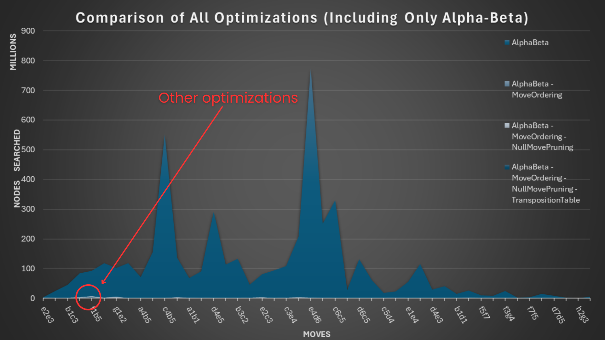

# Chesster

A lightweight chess engine written in C with Alpha-Beta pruning, transposition tables, move ordering, and null move pruning. Capable of competing at ~2000 Elo.

## Setup
git clone git@github.com:AbdouMurad/Chesster.git
cd Chesster
## Build and Run
gcc -c main.c AlphaBeta.c Board.c
gcc -o chesster *.o
./chesster
## Features
Chess engines work by exploring a game tree, where each node represents a possible board state after a move. The engine searches through these nodes to a certain depth, typically measured in plies (half-moves), to evaluate potential future outcomes. Using algorithms like minimax with optimizations such as alpha-beta pruning, the engine reduces the number of nodes it needs to search while still aiming to find the best move. The engine evaluates each position based on heuristics and selects the move that leads to the most favorable outcome assuming perfect play from both sides. The more efficiently an engine can prune the game tree and skip nodes, the further depth it can explore to find the best move. The node number grows eponentially as depth increases, making optimizations essential for any chess engine. Below are the optimizations that were included in this project. 

### AlphaBeta Pruning
Alpha-beta pruning is an optimization technique used in minimax-based algorithms to reduce the number of nodes evaluated in the game tree. It keeps track of two values: alpha, the best score the maximizing player can guarantee, and beta, the best score the minimizing player can guarantee. If at any point the algorithm finds a move that leads to a worse outcome than a previously examined move, it stops evaluating that branch. This results in faster decision-making without affecting the final outcome.

### Transposition Table
A transposition table (TT) is a cache used in game tree search to store previously evaluated board positions, avoiding redundant evaluations. It uses Zobrist hashing to generate a unique identifier for each board state, enabling quick lookups. When the same position appears again through a different move sequence, the engine can retrieve the stored evaluation instead of recalculating it. This drastically reduces the number of nodes searched, especially in complex games like chess where transpositions are frequent.

### Move Ordering
When generating moves, the engine will assign a score to each move based on captures, checks, castling, or general position. This score will give the engine a way to sort the moves and be able to find better moves quicker, this is because high value moves like captures are more likely to be the best move than moves with no captures. 

### Null Move Pruning
When simulating a null move (nothing happens the turn just switches with no piece moved), if the position is still very favourable despite the other player having the turn, it is very unlikely for the minimizing player to allow you to play that move. Meaning the node can be pruned as it is 'too good' of a move.

## Performance
Below is a link to my linkedin post which includes a video showcasing the performance of this engine against a 2000 elo bot on chess.com. 

//

.png)
The above graph shows the node count for every move played. It displays the performance of the engine with AlphaBeta + MoveOrdering, AlphaBeta + MoveOrdering + NullMovePruning, and finally AlphaBeta + MoveOrdering + NullMovePruning + Transposition Table

AlphaBeta + MoveOrdering and AlphaBeta + MoveOrdering + NullMovePruning have a very similar line and result in identical numbers except for some moves where NullMovePruning nearly halves the node count. On average NullMoveOrdering caused an improvement of on average around 3%. 

However transposition tables had a much greater impact with around a 34% decrease in nodes compared to without. 

These numbers may seem small, however each of these features alone hold a lot of strength compared to the engine without them. Below is another graph which includes the performance of the engine with only the basic AlphaBeta pruning.

That tiny line circled is the PEAK of the node count when using all the features but the TranspositionTable. On average by comparing the node count of only the AlphaBeta Pruning to all the features enabled, we see a 98.97% decrease in node count. This high number shows the importance of optimizations in algorithms, but also highlights the importance of small details in chess engines as more known chess engines are much further ahead in terms of performance despite this big number. 

## ToDo

 - Improve evaluation function (piece-square tables, mobility, king safety, etc.)
 - Implement quiescence search to avoid horizon effect
 - Parallelize search with multithreading
 - Implement UCI (Universal Chess Interface) protocol
 - Add opening book for early-game efficiency